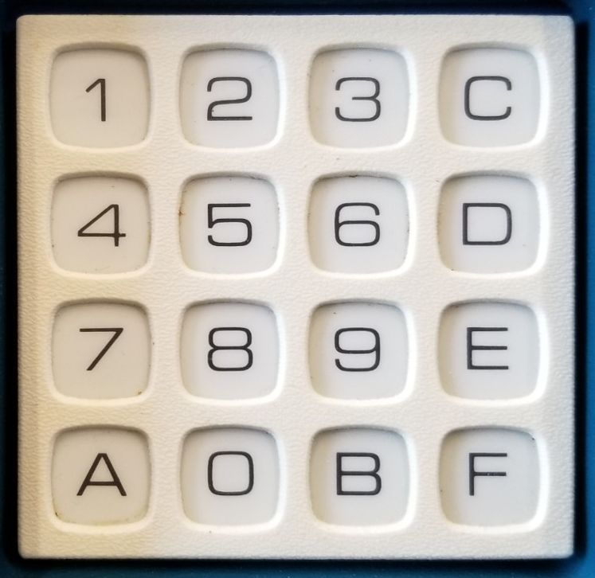

# Chip 8 Emulator

## Overview 
In my travels around the internet, I stumbled upon a blog post about making a Chip-8 emulator. Well, that looked like too much fun to pass up—challenge accepted!

I implemented this in Java since I've been using it a lot for my MSc in Comp Sci. It turned out to be a bit of a tricky choice because of the lack of unsigned integers. You'll see a lot of bitwise `& 0xFF` masking to keep values within the 8-bit range. If I did this again (and let's face it, I probably will with a bigger challenge—ZX Spectrum, maybe?), I'd likely use C++ or Go.

## Resources 
* https://otavio.dev/2024/12/08/chip-8-emulation/
* http://devernay.free.fr/hacks/chip8/C8TECH10.HTM
* https://tobiasvl.github.io/blog/write-a-chip-8-emulator/#specifications
* https://itch.io/games/tag-chip8

## ROMS collected from 
* https://salvacam.itch.io/zhunder-blade
* https://www.zophar.net/pdroms/chip8/chip-8-games-pack.html

## How to Build and Run

This project uses Maven, so building it is pretty straightforward.

1.  **Build the project:**
    Open up a terminal in the project root and run:
    ```bash
    mvn package
    ```
    This will create a `chip-8-1.0.jar` file in the `target` directory.

2.  **Run the emulator:**
    To run the emulator, use the following command, passing the path to a Chip-8 ROM file.
    ```bash
    java -jar target/chip-8-1.0.jar path/to/your/rom.ch8
    ```
    If you don't provide a ROM, it will try to load a default one from `ROMs/IBM Logo.ch8`.


## Keyboard Layout
The wizdom of the internet is to use the keyboard layout from the original CHIP-8 machine, which was a COSMAC-VIP. 




source wikipedia https://en.wikipedia.org/wiki/COSMAC_VIP

It’s customary to use the left side of the QWERTY keyboard for this:

|1 | 2 | 3 | 4 |
|---|---|---|---|
|Q | W | E | R |
|A | S | D | F |
|Z | X | C | V |
